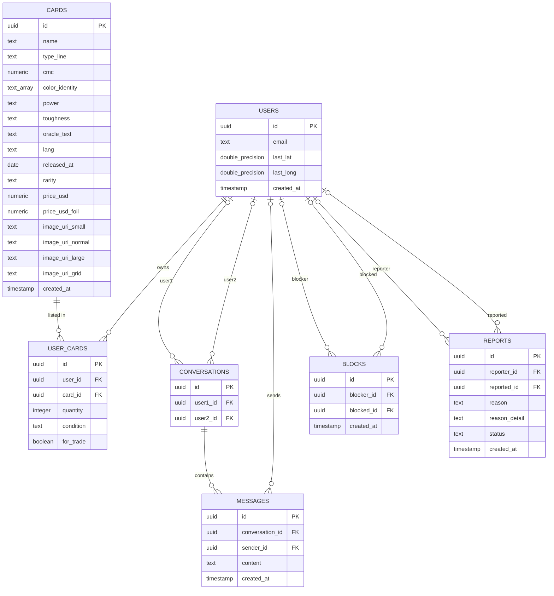

# TCGHub — Database Design

**Database:** PostgreSQL (relational)

This document describes the databse model for the TCGHub trading app: which tables exist, how they relate, and the rules that apply when data is deleted. ***At some stage I will update what the technical justification is for each table***

## 1. Table of tables

| Table | Purpose | Supports must-have | Status |
| --- | --- | --- | --- |
| `users` | Accounts and last known location | User profiles, location-based matching | Built |
| `cards` | Master catalogue of every card (sourced from Scryfall) | Card search | Built |
| `user_cards` | Which user owns which card, in what condition, and whether it is up for trade | List of cards for trading | Designed |
| `conversations` | A chat between two users | Messaging / chat | Designed |
| `messages` | Individual messages inside a conversation | Messaging / chat | Designed |
| `blocks` | "User A has blocked User B" | Blocking and reporting | Designed |
| `reports` | "User A reported User B", with a reason and a status | Blocking and reporting | Designed |

## 2. ER diagram

Relationship lines use crow's-foot notation. A line ending in `|o` means the link is optional (the foreign key can be `NULL`, which is required for the `ON DELETE SET NULL` rule described in section 5).

